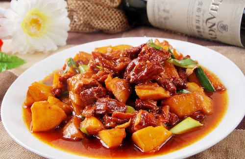
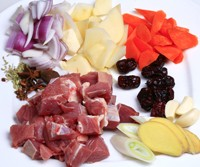
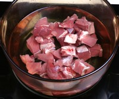
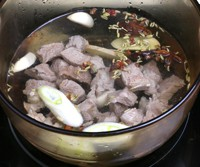
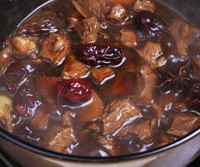
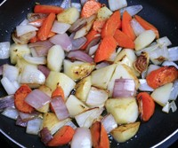
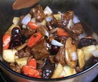

<!--
create time: 2015-10-18 21:14:26
Author: <TODO: 请写上你的名字>

This file is created by Marboo<http://marboo.io> template file $MARBOO_HOME/.media/starts/default.md
本文件由 Marboo<http://marboo.io> 模板文件 $MARBOO_HOME/.media/starts/default.md 创建
-->

## 内容的描述部分

|对象|说明|是否为必填|
|---|---|---|
|标题|最多22个字|必填|
|摘要|对帮助内容的描述，最多300个字|必填|
|封面图|作为帮助的封面，大小无限制，系统根据需要自动缩放|必填|

**举例：**  
标题：如何制作土豆烧牛肉  
摘要：土豆烧牛肉是中国东北地区和东北亚寒温带地区人民常用菜。可以算做是民间菜肴， 这里主要以吉林地区做法为主进行介绍。主料选择土豆和牛肉，采用红烧的技法，色泽红润，口感咸香，秋冬两季食用最佳。  
封面图：  

## 准备/材料
“准备/材料”显示在描述部分之后，为一组文本内容，组标题可自定义，如果是食谱类内容可以设置为：“材料”，其他类内容可以是：“准备”、“条件”等。

|对象|说明|是否为必填|
|---|---|---|
|组标题|“准备/材料”的标题，最多10个字|必填|
|内容项|“准备/材料”的内容，可以是0-n项，如果数量为0则“准备/材料”不显示，每项最多50个字|非必填|

**举例（土豆烧牛肉）：**  

标题：素材  
内容项：

1. 土豆
2. 胡萝卜
3. 洋葱
2. 牛肉
3. 老抽
4. 食盐
5. 白糖
6. 炖肉料包
7. 料酒
8. 生姜
9. 大葱

## 步骤
步骤为内容的正文，可分为多个组，每组内项目不限，可对组标题进行自定义，最少包含一组一步。

|对象|说明|是否为必填|
|---|---|---|
|组标题|当前步骤组的标题，最多15个字|必填|
|步骤|具体操作步骤，形式为：一张图片+对图片的说明文字。|最少一项|
|步骤图|步骤内的图片，尺寸不限，系统根据需要缩放|非必填|
|步骤内容|如上传了步骤图则为对步骤图的说明，字数不限，最好不要超过500字|必填|

**举例：**

步骤组一：食材处理

1. 牛腩切大块洗净并控干，土豆、胡萝卜切滚刀块、洋葱切块备用。  

2. 锅中做凉水放入牛肉块，焯水，吐尽血沫。  

步骤组二：烹饪

1. 锅中油中火烧至六成热，放入葱、姜爆锅，然后放入牛翻炒，片刻后加入，料酒和适量热水，大火烧开后转小火炖1小时后加白糖、盐调味。  

2. 加入老抽调色大火收汁。  

3. 锅中放少许油，烧热放入胡萝卜块、土豆块，洋葱块炒熟。  

4. 最后将土豆、胡萝卜、洋葱和牛肉放在一起炖5分钟即可出锅装盘。  

## 注意事项
"注意事项"显示在内容最后，为一组文本内容，标题不可自定义，如不设置则不显示注意事项。每项最多150个字

**举例：**  
注意事项：

1. 牛肉过水后只能加入热水，否则会炖不烂
2. 土豆、胡萝卜、洋葱不可和牛肉一起加，否则会炖的太烂
