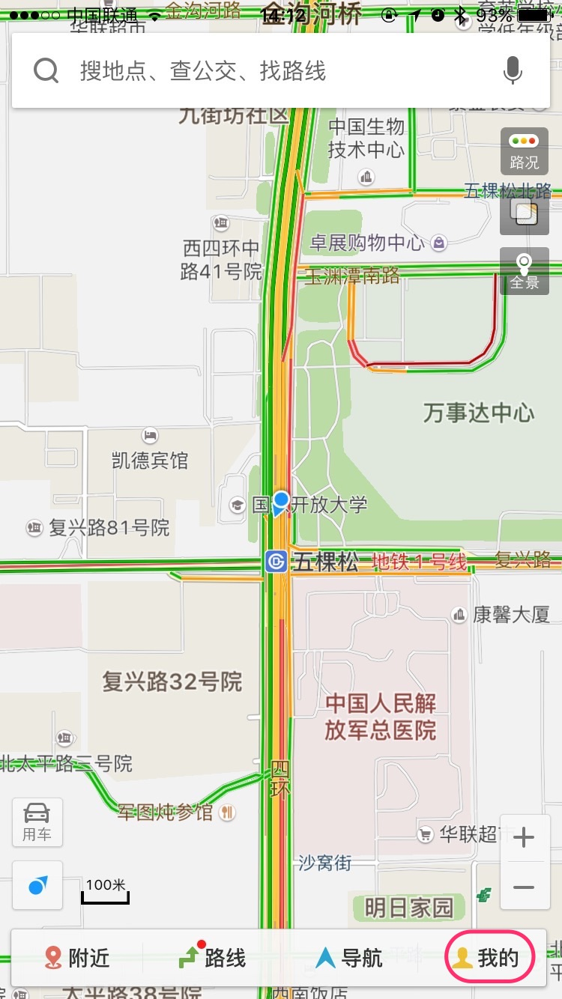

#如何使用百度地图的离线地图功能？

<!--
create time: 2015-10-21 17:10:58
Author: <TODO: 请写上你的名字>

This file is created by Marboo<http://marboo.io> template file $MARBOO_HOME/.media/starts/default.md
本文件由 Marboo<http://marboo.io> 模板文件 $MARBOO_HOME/.media/starts/default.md 创建
-->
有了智能手机出门再也不用带地图了，不过使用手机看地图比较费流量，幸好有离线地图功能可用，下面我分享下百度地图离线地图功能的使用方法。

封面图：  

###工具原料
1. 手机
2. 百度地图ios版

###下载地图

1.打开百度地图，点“我的”  
  
  
  
2.将进入“个人中心“”界面，在里面点“离线包下载” 
  
  
  
3.会进入“离线包下载“”界面，点“离线地图”
  
  
  
4.将进入“离线地图下载管理”界面，可以看到“北京”和“全国基础包”已被下载。继续点击“城市列表”
  
  
  
5.城市列表页面会显示所有可下载地图的城市，点任意城市开始下载，现在以“上海市”为例，点击“上海市”
  
  

6.“上海市”的地图将开始下载

  

7.返回下载管理可看到“上海市”的下载进度，完成后将出现在“下载完成”区域，点击“上海市”可暂停下载，再次点击可继续下载。

  

8.“上海市”已完成下载

  

9.如您想要一次下载全部地图，可在本界面下方蓝色区域找到“全部下载”按钮，点击即可实现该功能

  

###管理地图
1.如您想删除已下载地图，请先按照“下载地图”中的操作进行至第四步，进入“离线地图下载管理”界面，点要删除的城市，会在屏幕下方滑出操作菜单，点“删除”即可完成操作。

  

2.已经下载到您手机的地图可能会有更新版本，如您需要更新地图，则在第一步的界面最下方找到蓝色工具栏，在其最左侧点击“全部更新”按钮。如此时有需要更新的地图，则会显示更新进度，静待其更新完毕即可。

  