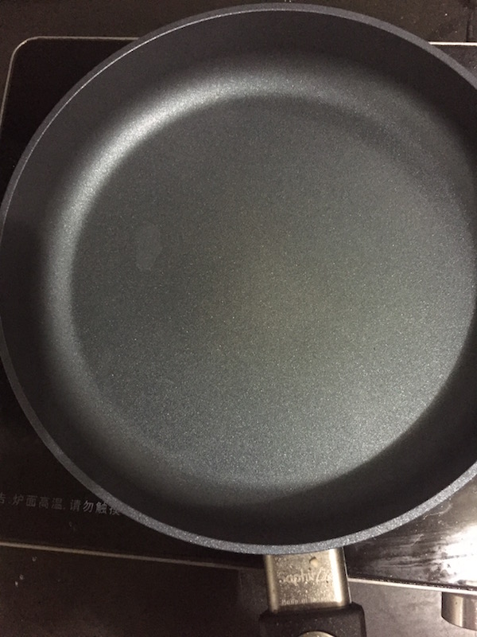
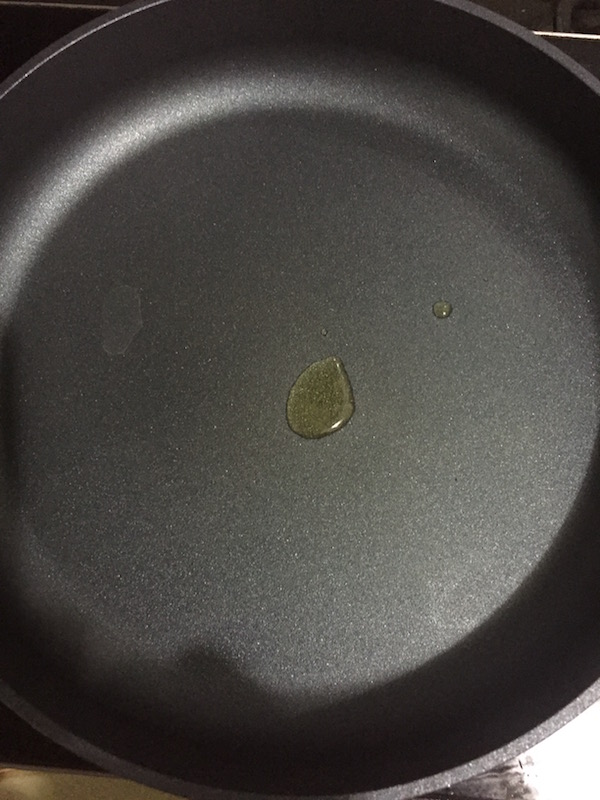
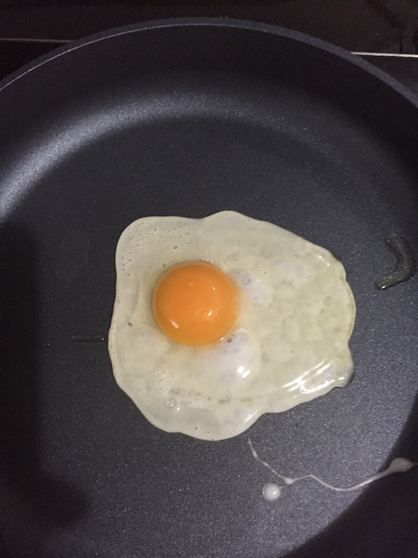
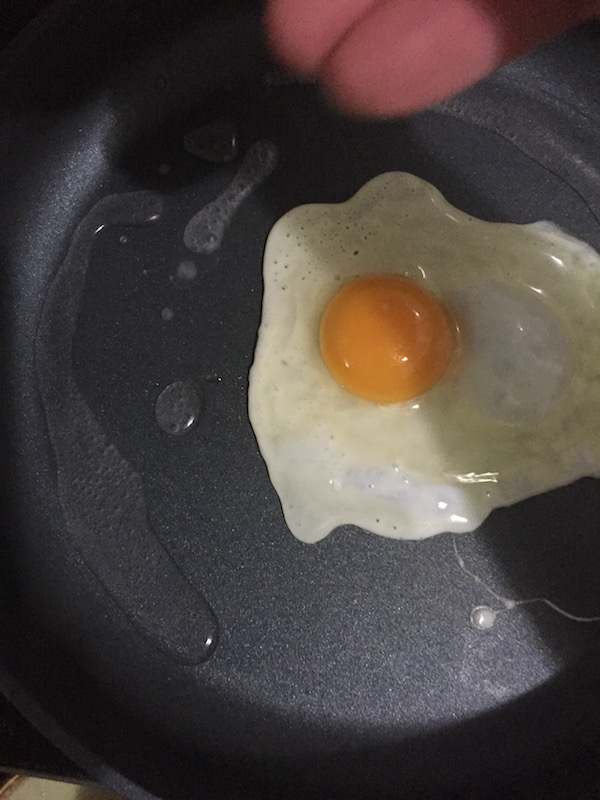
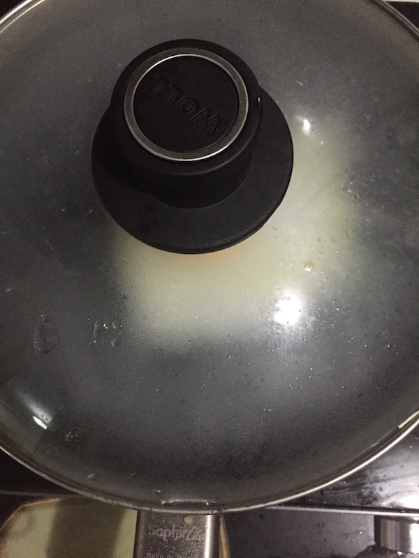
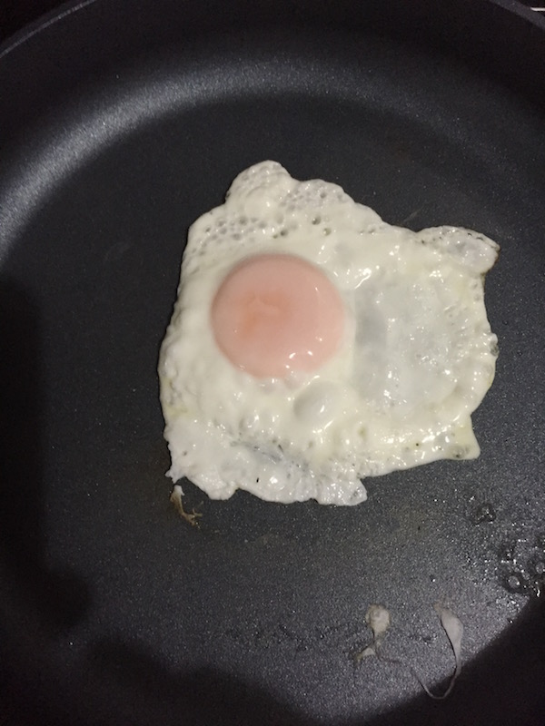
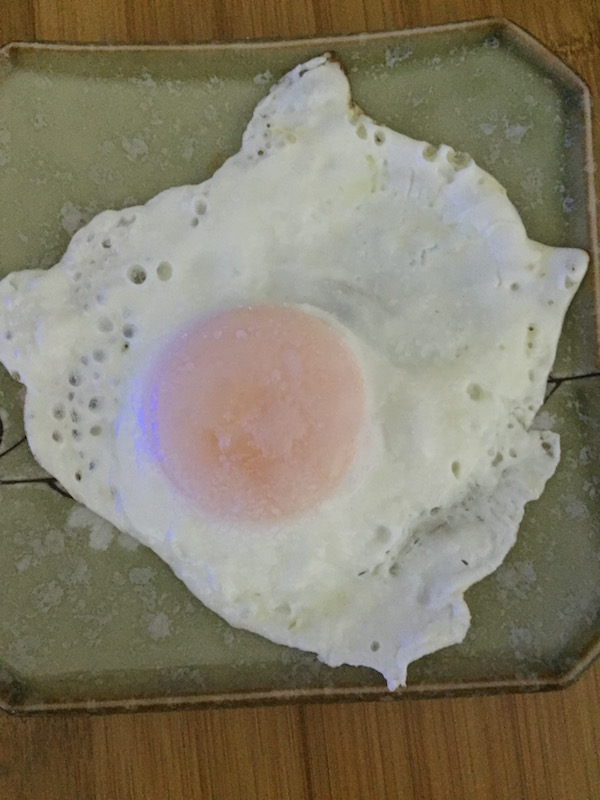
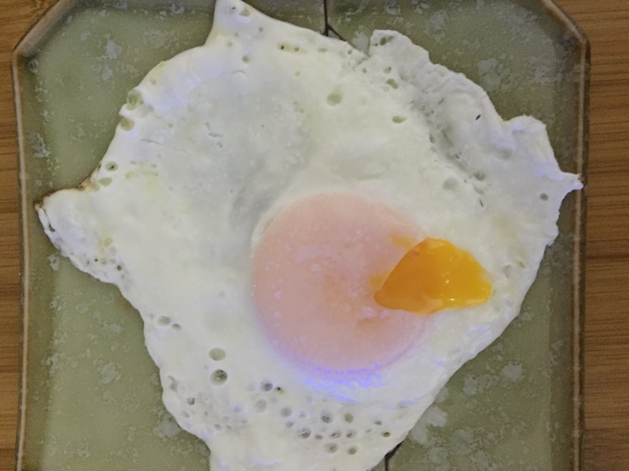

# 如何煎糖心荷包蛋

<!--
create time: 2015-10-25 00:56:31
Author: <TODO: rteam>
-->

煎荷包蛋大家都会，但是煎糖心荷包蛋就有些难度了。如何将蛋黄煎熟薄薄一层，但里面的蛋液又不凝固对火候控制是个小考验。下面我介绍一种简单的糖心荷包蛋煎法，希望对大家有所帮助

##工具原料
1. 平底锅一口，最好是不粘锅
2. 鸡蛋一枚
3. 食用油一毫升
4. 水十毫升
5. 盐一克

##步骤/方法
1. 首先大火热锅，觉得差不多了往锅里滴几滴水，如果水凝结成珠并快速在锅内滚动说明锅以热好；水一下就蒸发了，说明锅太热了。  

2. 锅热后关中小火，往锅里放几滴油（约1毫升），一定不要多放，否则煎蛋会很油腻。  

3. 将鸡蛋磕开一个口，打入锅内，注意鸡蛋打入时不要离锅底太远，否则会散。这时候由于之前锅已经很热了，蛋白部分会快速凝结。  

4. 往锅的边缘加一些水（5-10毫升）  

5. 盖上锅盖，将火力调制小火，利用水蒸气使蛋黄外侧凝结。  

6. 煎大约2分钟开盖，根据自己的口味在蛋上薄薄的撒上一层盐  

7. 装盘，现在可以吃了！  

8. 挑开一点可以看到里面的蛋液会流出，非常成功！  

##注意事项
1. 因为糖心荷包蛋没有完全煎熟，所以请选择新鲜鸡蛋，最好是品牌鸡蛋。
2. 制作前请将鸡蛋外壳洗净。
3. 平底锅最好是不粘锅，如是铝合金锅，那么一定要严格执行热锅程序，以免粘锅。